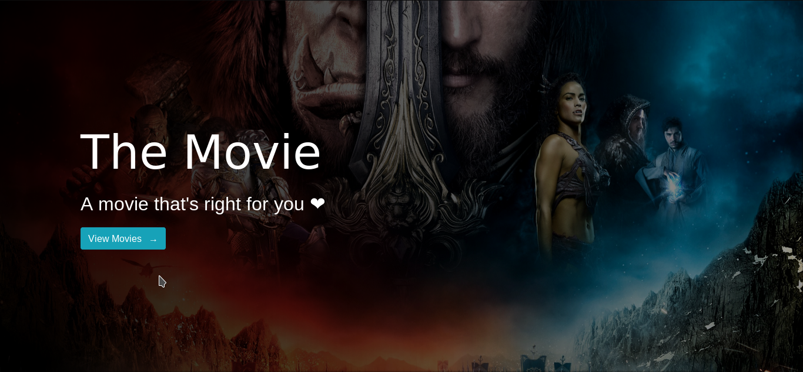
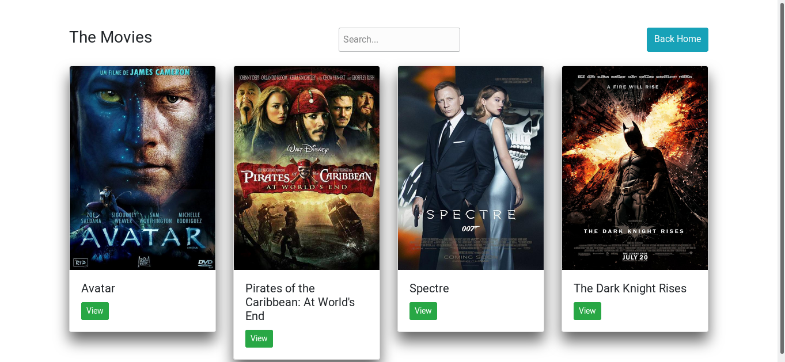
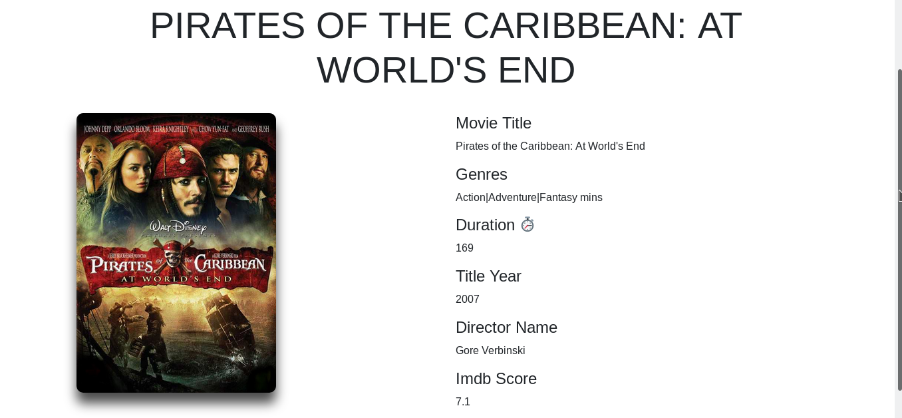

# movie-django-vue
Build full application using Django, DjangoRestFramework and Nuxt.js


[](https://codecov.io/gh/alisonamerico/movie-django-vue)
[](https://travis-ci.org/alisonamerico/movie-django-vue)
[](https://pyup.io/repos/github/alisonamerico/movie-django-vue/)
[](https://pyup.io/repos/github/alisonamerico/movie-django-vue/)

### Requirements
* [Python3](https://www.python.org/download/releases/3.0/)
* [Pipenv](https://pypi.org/project/pipenv/)
* [Npm](https://www.npmjs.com/get-npm) or [Yarn](https://yarnpkg.com/en/)

### Backend

Processos utilizados no desevolvimento do projeto:

Entrega Contínua:

 - Integração com Pipenv Travis e Pyup
 
 - Deploy Automático
 
 - Pytest: Para configurar e construir testes automatizados para o Django.
 
 - Codecov: Para cobertura de testes
 
 - python-decouple: Para desacoplar as configurações de instância da aplicação.

 - CDN da Amazon (S3): Para poder enviar e acessar os arquivos na nuvem.   

### Screenshots:

##### Home


##### List Movie


##### Detail Movie



Como instalar localmente (supondo que você tenha git e python> = 3.7 instalado):
```console
git clone https://github.com/alisonamerico/movie-django-vue
cd movie-django-vue
cp contrib/env-sample .env
pipenv install
pipenv shell
```
Se você quiser usar o SQLite no seu ambiente de desenvolvimento, remova DATABASE_URL do arquivo .env. Caso contrário, preencha este valor com suas credenciais de banco de dados.

Você pode fazer várias migrações para gerar o esquema do banco de dados:
```console
python manage.py migrate
``` 
Você também pode criar um usuário:
```console
python manage.py createsuperuser
```
Para executar o servidor localmente (com virtualenv ativado):
```console
python manager.py runserver
```
API disponível em:
```console
http://127.0.0.1:8000/api/
```
Obs.: Para visualizar os dados na API é necessário logar com as credências criadas.
```console
http://127.0.0.1:8000/rest-auth/login/
```
Obs.: Antes de visualizar os dados, é preciso que você cadastre alguns dados, pode ser feito
através do admin do django em: 
```console
http://127.0.0.1:8000/admin/
```
ou diretamente através da API(desde que esteja logado) em:
```console
http://127.0.0.1:8000/api/movies
```

Para executar os testes:
```console
pytest backend --cov=backend
```

### Frontend
Abra uma nova instância do terminal (a partir do diretório raiz do projeto) e navegue até o diretório `frontend`:
```console
cd web
```

Instalar dependências:
```console
yarn install
```

Inicie o servidor de desenvolvimento frontend:
```console
yarn run serve
```

Aplicativo disponível em:
```console
http://localhost:8080/
```

É preciso está autenticado no frontend para que possa visualizar a lista de filmes:
```console
http://localhost:8080/login
```

### Construído com
* [Python](https://www.python.org/) - Uma linguagem de programação que permite trabalhar rapidamente e integrar sistemas de maneira mais eficaz.
* [Django](http://djangoproject.org/) - Um framework Web Python de alto nível que incentiva o desenvolvimento rápido e um design limpo e pragmático.
* [Nuxt](https://nuxtjs.org/) - O Nuxt.js é uma estrutura mínima para criar aplicativos Vue.js com renderização do lado do servidor, divisão de código, hot-recarregamento, geração estática e muito mais.